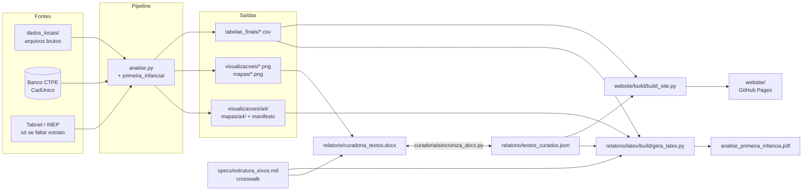

# Diagnóstico da Primeira Infância Carioca — especificação funcional e técnica

> Documento de referência do projeto: o que ele entrega, para quem, com que dados, como é construído e como se
> mantém. Estado em **2026-09-29** (`spec/pendencias`: faixa padrão 0 a 5 anos, exclusões E12-E15, eixo cortado no baixo peso, tablet). As decisões
> de cada mudança, com o *porquê*, estão nas pastas de rodada em `specs/`; o que falta fazer está em `ROADMAP.md`.
> Atualize este documento quando uma rodada mudar algo descrito aqui (seção 11).

## Sumário

1. [Visão geral](#1-visão-geral)
2. [Escopo: eixos e indicadores](#2-escopo-eixos-e-indicadores)
3. [Fontes de dados](#3-fontes-de-dados)
4. [Requisitos funcionais](#4-requisitos-funcionais)
5. [Requisitos não funcionais](#5-requisitos-não-funcionais)
6. [Arquitetura e fluxo de dados](#6-arquitetura-e-fluxo-de-dados)
7. [Componentes](#7-componentes)
8. [Regras de dados e convenções](#8-regras-de-dados-e-convenções)
9. [Processos](#9-processos)
10. [Operação: como rodar, gerar e publicar](#10-operação-como-rodar-gerar-e-publicar)
11. [Manutenção deste documento](#11-manutenção-deste-documento)
12. [Limitações conhecidas e pendências](#12-limitações-conhecidas-e-pendências)
13. [Glossário](#13-glossário)

---

## 1. Visão geral

**O que é.** Um diagnóstico da primeira infância (0 a 5 anos, até 72 meses; a política municipal fala em até 6 anos) no município do Rio de Janeiro, produzido pela
Coordenadoria de Pesquisa, Avaliação e Política Pública do **Instituto Pereira Passos (IPP)** em parceria com a Casa
Civil, como documento de apoio ao desenho, à implementação e ao monitoramento da **Política Integrada da Primeira
Infância**. Reúne indicadores de população, assistência social, saúde, educação, proteção e nutrição que estão
espalhados por fontes diferentes, e os organiza pelos **eixos da política municipal**.

**Para quem.** Gestores e técnicos da Prefeitura (público principal do site e do PDF); a equipe do IPP, que cura os
textos e mantém o pipeline; e quem quiser reproduzir os números (código e dados públicos no GitHub).

**O que entrega.**

| Produto | Onde | Para quê |
|---|---|---|
| Site interativo | GitHub Pages (`website/`) | leitura na tela: abas por eixo, gráficos e mapas com tooltip, tabela alternativa e CSV de cada figura |
| Relatório técnico em PDF | `relatorio/analise_primeira_infancia.pdf` (157 páginas, ABNT NBR 10719) | leitura, impressão e citação; todas as tabelas no apêndice |
| Tabelas finais | `tabelas_finais/*.csv` (87) | os números por trás de cada figura |
| DOCX de curadoria | `relatorio/curadoria_textos.docx` | a equipe escreve e revisa os textos que acompanham as figuras |
| Apresentação | `apresentacao/apresentacao_primeira_infancia.pptx` e `.pdf` (30 slides) | apresentar o diagnóstico a gestores das secretarias; gerada de um único Markdown, com variantes por público |
| Código | `analise.py` + `primeira_infancia/` | reprodução completa, da fonte bruta à figura |

**Estado.** Em desenvolvimento: o site mostra uma faixa "EM DESENVOLVIMENTO / TEMPORÁRIO" e o PDF sai com marca
d'água, controladas juntas por `relatorio/publicacao.json` (seção 9.4).

---

## 2. Escopo: eixos e indicadores

A estrutura publicada abre com um **panorama** (Introdução: população e nascimentos) e segue os **7 eixos da política
municipal de primeira infância** (`specs/2026-09-28_nova_estrutura`; até então, 6 eixos, sem panorama). O crosswalk entre o catálogo
de indicadores da Prefeitura (`dados_locais/painel_primeira_infancia_cesta_indicadores.xlsx`) e os arquivos reais
(gráficos, mapas, tabelas) é `specs/estrutura_eixos.md`, **editado à mão**: é ele que define o que entra no PDF e no
DOCX, em que ordem e com que título.

| Eixo | Foco da política | Indicadores | Pendentes | Gráficos | Mapas | Tabelas |
|---|---|---:|---:|---:|---:|---:|
| 🧭 Introdução (panorama, não é eixo) | quantas crianças há, onde vivem, quem são (sexo, raça/cor) e quantas nascem | 7 | 0 | 7 | 4 | 9 |
| 🎯 Prioridade | gestantes e crianças em vulnerabilidade: mortalidade materna, neonatal, infantil e por causas evitáveis; CadÚnico (razão sobre a população, crianças, famílias, renda, sexo, raça/cor) | 15 | 1 | 36 | 13 | 46 |
| 🤝 Inclusão | crianças com deficiência (CadÚnico) | 3 | 3 | 0 | 0 | 0 |
| 👨‍👩‍👧 Família e Cuidados | frequência escolar (total, raça/cor, sexo, taxa total do Censo 2022), matrículas e atendimento, cobertura vacinal, CadÚnico por renda e arranjo familiar | 8 | 0 | 11 | 1 | 10 |
| 🛡️ Proteção | violência familiar (por vínculo do autor, taxas, bairros e CAP), notificações | 7 | 2 | 6 | 7 | 13 |
| 🧸 Direito ao Brincar | violência territorial (IPS, por RA) | 1 | 0 | 0 | 3 | 1 |
| 🍽️ Alimentação | baixo peso ao nascer, desnutrição e sobrepeso (SISVAN) | 6 | 0 | 4 | 2 | 6 |
| 🏠 Moradia | inadequação e adensamento habitacional | 3 | 3 | 0 | 0 | 0 |
| **Total** | | **50** | **9** | **64** | **30** | **85** |

"Pendente" (`status: pendente` no crosswalk) é indicador do catálogo ainda sem dado: aparece no site e no PDF como
caixa "indicador em desenvolvimento", com uma frase pública fixa seguida do `motivo:` do item (texto formal,
obrigatório; as notas internas nunca são publicadas). Tabelas que o site mostra dentro do cartão saem no corpo da seção
do PDF (`tabela_no_texto:`), não no apêndice (`specs/2026-09-29_alinhamento_pdf_site`).

**Níveis geográficos.** Município; e, abaixo dele, **bairro** (166, chave `codbairro`), **Área de Planejamento** (AP,
5, IPP), **Região de Planejamento** (RP, 16), **Região Administrativa** (RA, 33 — não existe RA 32) e **Coordenadoria
de Área Programática de Saúde** (CAP, 10, SMS-Rio). AP e CAP são divisões diferentes, com códigos parecidos.

**Fora do escopo** (decidido pela equipe, com motivo e como reverter, em `specs/exclusoes.md`): por exemplo, mapas de
contagem que duplicam o de taxa (no site viram a alternância Taxa ↔ Óbitos), séries de frequência escolar em número
absoluto, a série anual de cobertura vacinal.

---

## 3. Fontes de dados

Cada fonte tem uma entrada em `relatorio/latex/fontes.bib` (referência ABNT NBR 6023, lista "Fontes" do PDF e do
site) com um padrão que liga o texto `fonte_dados` de cada figura à entrada. `relatorio/inventario_fontes.md/.csv`
(gerado) cruza fonte × arquivo × eixo, para conferência da equipe.

| Chave (`fontes.bib`) | Fonte | O que traz | Onde |
|---|---|---|---|
| `ibge_censo2022` | Censo Demográfico 2022 (IBGE/SIDRA) | população 0-6 por idade, sexo, raça/cor; frequência escolar | `dados_locais/ibge_sidra/` |
| `ipp_datario_censo` | Censos 2000/2010/2022 (Data.Rio/IPP) | população 0-4 por bairro | `dados_locais/censo/` |
| `ms_ripsa_populacao` | Estimativas Ripsa/Ministério da Saúde | população por idade simples e sexo, 2000-2025 — denominador municipal | `dados_locais/populacao/` (extrato versionado; Tabnet só se faltar um ano) |
| `sms_rio_sim` | SIM (SMS/SVS-Rio, Tabnet e TabWin) | óbitos infantis, maternos, por causas evitáveis (bairro, CAP) | `dados_locais/mortalidade/` |
| `sms_rio_sinasc` | SINASC (SMS-Rio) | nascidos vivos, baixo peso | `dados_locais/nascidos_vivos/`, `dados_locais/mortalidade/` |
| `sms_rio_sinan` | SINAN (SMS-Rio) | notificações de violência familiar e autoprovocada | `dados_locais/protecao/` |
| `ms_sisvan` | SISVAN (MS) | estado nutricional de crianças | `dados_locais/sisvan/` |
| `sms_rio_epi_vacinal` | SI-PNI/EPI (SMS-Rio) | cobertura vacinal | `dados_locais/vacinacao/` |
| `mds_cadunico` | Cadastro Único (extração CTPE) | famílias e crianças por renda, idade, sexo, raça/cor, arranjo, bairro | **banco PostgreSQL do CTPE** (não é arquivo) |
| `ibge_pnadc` | PNAD Contínua (IBGE) | **não usada desde 2026-09-29**: o arquivo "PNAD" trazia a taxa do Censo 2022 (E15) | `dados_locais/educacao/` |
| `inep_censo_escolar` | Censo Escolar (INEP, microdados) | matrículas 0-5 anos, 2007-2025 | `dados_locais/educacao/` (extrato; ZIPs baixados só se faltarem) |
| `ipp_ips2024` | Índice de Progresso Social 2024 (IPP) | violência territorial por RA | `dados_locais/protecao/` |
| `ipp_limites_bairros` | Limites oficiais (Data.Rio/IPP, SMS, IBGE) | geometrias de bairro, CAP, UF, municípios vizinhos | `dados_locais/geo/` |

Os dados brutos estão em `dados_locais/` (versionado — ver 8.4). A cópia integral da versão de trabalho fica num
Google Drive de acesso restrito do IPP.

---

## 4. Requisitos funcionais

### 4.1 Pipeline de dados (`analise.py`)

- **RF1** Ler cada fonte bruta, limpar e padronizar (códigos de bairro, faixas etárias reais, anos), e gravar a tabela
  final de cada indicador em `tabelas_finais/`.
- **RF2** Calcular taxas e percentuais a partir dos absolutos (numerador e denominador), inclusive ao agregar bairros
  em AP/RP/RA/CAP.
- **RF3** Gerar, para cada indicador, o gráfico de tela (`visualizacoes/*.png`) e o mapa coroplético
  (`mapas/*.png`, com a tabela-insumo gêmea `tabelas_finais/tabela_mapa_*.csv`), com fonte citada.
- **RF4** Gerar a **variante de impressão** de cada figura (`visualizacoes/a4/`, `mapas/a4/`, PDF vetorial no tamanho
  final do A4, sem título nem fonte embutidos) e o manifesto `visualizacoes/a4/_manifesto.csv` (título, fonte,
  unidade) lido pelo PDF. Uma falha numa variante vira aviso, não interrompe o notebook.
- **RF5** Proteger toda saída sub-municipal do CadÚnico antes de gravá-la: nenhuma contagem < 20. Por bairro, o bairro
  pequeno é **somado aos outros bairros pequenos da RA** (depois AP, depois município), também quando um percentual
  publicado revelaria numerador ou complemento < 20 (`agrega_bairros_pequenos`, `specs/2026-09-29_privacidade_cadunico`);
  demais células pequenas ficam vazias (`suprime_celulas_pequenas`).

### 4.2 Site interativo (`website/`)

- **RF6** Uma aba "Visão geral" (Introdução + cartões dos eixos) e uma aba por eixo; cada eixo abre com "Principais
  achados", o texto de abertura do eixo, as subseções (indicadores), a síntese e a caixa "Fontes desta seção".
- **RF7** Gráficos SVG interativos: tooltip, tabela de dados alternativa, download do CSV, opção sem outliers nas
  taxas, alternância entre opções (pills ou `<select>` com 6+), pequenos múltiplos para 7+ séries.
- **RF8** Mapas SVG por bairro/AP/RP/RA/CAP, com tooltip por região, legenda, rosa dos ventos, escala, fundo
  cartográfico e CSV; mapa de taxa e de contagem do mesmo indicador em alternância "Taxa ↔ Óbitos".
- **RF9** Sumário lateral "Nesta seção" com progresso de leitura (no celular, faixa recolhível); rotas por hash
  (`#eixo/secao`), inclusive para âncoras antigas renomeadas.
- **RF10** Texto de cada figura: o curado (`relatorio/textos_curados.json`) ou, enquanto não houver, lorem ipsum
  determinístico de até 150 palavras (marca o lugar do texto sem inventar leitura dos dados).
- **RF11** Versão para celular e tablet sem alterar o desktop (≥ 1100 px).

### 4.3 Relatório em PDF (`relatorio/latex/`)

- **RF12** Relatório técnico ABNT (abnTeX2): capa, folha de rosto com a equipe, resumo, listas de gráficos, mapas,
  tabelas e siglas, sumário, Introdução, "Como ler este relatório", um capítulo por eixo, Considerações finais,
  Fontes (NBR 6023) e apêndice de tabelas.
- **RF13** Capítulos gerados a partir de `specs/estrutura_eixos.md` e `relatorio/textos_curados.json` na hora da
  compilação: mudar o crosswalk basta para o PDF mudar.
- **RF14** Tabelas no apêndice com regras de tamanho (tabelas longas só digitais; bairro × ano só o último ano;
  bairros em duas colunas, com o nome oficial buscado pelo código).
- **RF15** Legenda ABNT em toda figura (título, fonte ligada ao `fontes.bib`, unidade).

### 4.4 Curadoria de textos (`relatorio/curadoria/`)

- **RF16** Exportar um DOCX com todas as figuras e um bloco de texto por figura (bookmark = chave), mais os blocos do
  relatório (resumo, achados, abertura e síntese de cada eixo, considerações finais) e a tabela "Controle de revisão".
- **RF17** Sincronizar o texto editado no DOCX de volta para `textos_curados.json`, o site, o PDF e as notas de
  curadoria em `analise.py`, sem nunca perder texto (o que sai da estrutura vai para "Textos órfãos").
- **RF18** Incorporar rodadas de revisão feitas no Google Docs (que apaga bookmarks), casando os textos por título e
  posição, e registrar o status de cada texto (revisado, atualizado, a escrever) em `relatorio/controle_revisao.json`.
- **RF19** Validar que todo texto curado está publicado no site e no PDF, frase a frase.

### 4.5 Apresentação (`apresentacao/`, `specs/2026-09-28_apresentacao`)

- **RF20** Gerar o deck (PPTX com notas do apresentador e PDF) a partir de um único Markdown (`apresentacao.md`), com
  números calculados de `tabelas_finais/` (nunca digitados), figuras do `analise.py` e blocos ligados/desligados pelo
  cabeçalho, para derivar versões por público ou secretaria (`apresentacao/variantes/`).
- **RF21** Mapas dos slides sem distorção por valores extremos: versão de impressão (teto de cor no percentil 95 por
  bairro) ou, por pedido, mapa próprio com a regra de outlier do site (cercas de Tukey), sempre dito no rodapé.

---

## 5. Requisitos não funcionais

| # | Requisito | Como é garantido |
|---|---|---|
| RNF1 | **Reprodutibilidade**: o mesmo código e os mesmos dados dão as mesmas saídas | geradores determinísticos (duas gerações seguidas do site com md5 idêntico); refatorações validadas por hash de todas as saídas (`specs/2026-09-28_organizacao`: 431/431) |
| RNF2 | **Privacidade**: nenhuma célula sub-municipal do CadÚnico < 20 publicada; nenhum microdado de pessoa; credenciais fora do git | `agrega_bairros_pequenos` (bairro) e `suprime_celulas_pequenas`; `.env` no `.gitignore` (modelo em `.env.example`); `specs/constitution.md` §6 |
| RNF3 | **Site estático**: só html/css/js/svg/png/jpg/ico, caminhos relativos, rotas por hash, sem `fetch`, sem build no deploy | workflow de deploy com lista de inclusão e checagem de extensões; `website/README.md` |
| RNF4 | **Tamanho**: `index.html` ≤ 1 MB, site ≤ 2 MB (hoje 343 KB e 1,05 MB); PDF < 20 MB (hoje 14,2 MB) | o gerador do site imprime o tamanho e avisa no estouro |
| RNF5 | **Cache**: o navegador nunca mistura HTML novo com CSS/JS antigos | `?v=<md5 do conteúdo>` em todo recurso |
| RNF6 | **Acessibilidade**: contraste WCAG AA, navegação por teclado, leitor de tela, alvos de toque de 44 px no celular, `prefers-reduced-motion` | tokens de cor validados; `specs/2026-09-24_website_refactor`, `specs/2026-09-28_website_mobile` |
| RNF7 | **Rastreabilidade**: toda figura cita a fonte; toda decisão tem registro | `fonte_dados` obrigatório; `fontes.bib`; pastas de rodada em `specs/`; `CHANGELOG.md` |
| RNF8 | **Fidelidade do texto curado**: texto da equipe nunca é reescrito para caber ou compilar | escape no LaTeX (`esc()`); alertas registrados em `controle_revisao.json` em vez de corrigidos |
| RNF9 | **Identidade visual consistente** entre figuras | paletas e fontes centralizadas (`primeira_infancia/estilo.py`, `impressao.py`; `css/main.css`); validador de paleta da skill `dataviz` |

---

## 6. Arquitetura e fluxo de dados



Pontos importantes do desenho:

- **Uma fonte da verdade por coisa.** Números: `tabelas_finais/` (geradas por `analise.py`). Estrutura do PDF/DOCX:
  `specs/estrutura_eixos.md`. Textos: `relatorio/textos_curados.json`. Estado de publicação:
  `relatorio/publicacao.json`. Fontes: `relatorio/latex/fontes.bib`.
- **Site e PDF têm pipelines e identidades visuais separados**: o site desenha seus próprios SVGs a partir das
  tabelas; o PDF usa as figuras do próprio notebook na variante de impressão. Não misturar convenções.
- **Ordem do notebook = ordem de dependência de dados**, não a de apresentação (uma seção pode usar tabelas de uma
  anterior). A apresentação por eixo é feita pelo crosswalk, sem reordenar células
  (`specs/2026-09-22_ajuste_eixos` §9.1).
- **Saídas geradas são versionadas** onde o CI precisa delas (`website/index.html`, `website/data/`, o PDF,
  `relatorio/latex/gerado/`); `tabelas_finais/`, `visualizacoes/` e `mapas/` são ignoradas pelo git (exceto arquivos
  antigos já rastreados).

---

## 7. Componentes

### 7.1 Código

| Caminho | Papel | Editado |
|---|---|---|
| `analise.py` | notebook (Jupytext `py:percent`): setup, uma seção por fonte na ordem de dependência (Censo 2022, CadÚnico, DataSUS/Tabnet — nascidos vivos, baixo peso, mortalidade —, SISVAN, cobertura vacinal, Censo 2022 (SIDRA)/Censo Escolar/INEP, junções, Proteção), notas de curadoria e a seção editorial final (não publicada) | à mão; `analise.ipynb` é gerado e ignorado |
| `primeira_infancia/` | funções reutilizáveis, um módulo por tema: `conexao`, `limpeza`, `estilo`, `impressao`, `graficos`, `mapas`, `protecao`, `cadunico`, `populacao`, `educacao` | à mão |
| `website/build/build_site.py` | gera `website/index.html`, `data/charts.js` (dados dos gráficos e mapas), `data/geo.js` (geometria compartilhada) | à mão |
| `website/css/`, `website/js/` | estilo (tokens em `main.css`, celular em `mobile.css`) e motor de gráficos, abas, sumário | à mão |
| `website/build/gera_favicon.py`, `confere_textos.py` | favicon a partir de `favicon_opcoes/`; tabela de conferência texto × figura | à mão |
| `relatorio/latex/relatorio.tex`, `estilo.sty`, `pretextual/`, `textual/`, `fontes.bib` | documento ABNT | à mão |
| `relatorio/latex/build/` | `gera_latex.py` (capítulos, apêndice, compilação), `tabelas.py`, `inventario_fontes.py`, `gera_icones.py` | à mão |
| `relatorio/latex/gerado/` | saída do gerador (versionada, legível em diff) | **nunca à mão** |
| `relatorio/curadoria/` | `gera_estrutura_eixos.py` (lê o crosswalk; usado por site, PDF e DOCX), `gera_docx_curadoria.py`, `sincroniza_docx.py`, `incorpora_update_docx.py`, `compara_updates.py`, `valida_textos_publicados.py` | à mão |
| `.claude/skills/` | instruções operacionais para o assistente: `generate_map`, `build_website`, `export_pdf_report` | à mão |

### 7.2 Dados e saídas

| Caminho | Conteúdo |
|---|---|
| `dados_locais/<fonte>/` | dados brutos, uma pasta por fonte (`censo`, `mortalidade`, `nascidos_vivos`, `sisvan`, `ibge_sidra`, `vacinacao`, `educacao`, `populacao`, `protecao`, `geo`); `tratados/` = intermediários |
| `tabelas_finais/` | CSVs finais, `{tema}_{indicador}[_{corte}]_{granularidade_ou_ano}.csv`; `tabela_mapa_*.csv` = insumo de cada mapa |
| `visualizacoes/`, `mapas/` | PNG de tela com o mesmo nome do CSV correspondente; `a4/` = variantes de impressão |
| `relatorio/` | PDF publicado, DOCX de curadoria, `textos_curados.json`, `controle_revisao.json`, `publicacao.json`, inventário de fontes, `textos_updates_antigos/` |

### 7.3 Documentação

`README.md` (entrada), `CLAUDE.md` (guia para o assistente), este documento, `ROADMAP.md` (fila e histórico),
`CHANGELOG.md` (histórico completo), `specs/constitution.md` (regras inegociáveis), `specs/tech-stack.md` (stack e
alternativas rejeitadas), `specs/estrutura_eixos.md` (crosswalk), `specs/exclusoes.md`, `website/README.md` (regras
do site) e as pastas de rodada `specs/<AAAA-MM-DD>_<nome>/`.

---

## 8. Regras de dados e convenções

As regras completas estão em `specs/constitution.md`; estas são as que mais afetam quem mexe no projeto.

### 8.1 Dados

- **Junção por bairro sempre pelo código numérico** (`codbairro` / `codigo` do Tabnet), nunca pelo nome.
- **Nunca agregar taxa ou percentual por soma ou média**: somar numerador e denominador e recalcular
  (`agrega_bairros_por_nivel`).
- **Denominador por nível**: taxas municipais usam a estimativa Ripsa/MS do mesmo ano; taxas sub-municipais usam o
  Censo 2022 (fixo) e dizem isso na fonte ou na legenda.
- **Faixa padrão 0 a 5 anos (até 72 meses)**: os 6 anos ficam fora dos gráficos e números, e qualquer uso deles leva
  nota; títulos que vêm do catálogo dizem "até 72 meses" (`specs/2026-09-29_pendencias` D9, D18). Onde a fonte só tem
  outra faixa (Censo por bairro: 0 a 4), o rótulo diz a faixa real.
- **Taxas publicadas agregadas por taxa × população** (somar e dividir pela população), nunca média simples; não dividir
  contagens de tabelas de bases diferentes (D14).
- Taxas de mortalidade **por mil nascidos vivos** (‰), nunca em %.

### 8.2 Figuras

- Toda figura cita a fonte (`fonte_dados`).
- Mapas: **contagem em classes discretas, taxa/percentual em escala contínua** (com teto no percentil 95 por bairro);
  paleta sequencial por tema (natalidade, mortalidade, CadÚnico, população, proteção); azul reservado ao mar.
- Séries com 7 ou mais linhas viram pequenos múltiplos.
- **Base zero** em todo gráfico de taxa, exceto o percentual de baixo peso ao nascer (eixo cortado, marca de corte e
  nota "eixo não começa em zero").

### 8.3 Nomes

- Colunas anuais agregadas terminam em `_anual`; colunas de taxa têm nome descritivo (`taxa_mortalidade_precoce`).
- Arquivos: o PNG reaproveita o nome do CSV correspondente.

### 8.4 Git e artefatos

- `dados_locais/` **é versionado** (conferir antes de pôr dado sensível ali).
- Não editar à mão o que é gerado (`website/index.html`, `website/data/`, `relatorio/latex/gerado/`, o PDF,
  `tabelas_finais/`, figuras): editar o gerador.
- Mudança arriscada ou de estrutura: abrir uma rodada em `specs/` antes (seção 9.1).

---

## 9. Processos

### 9.1 Rodadas de especificação

Toda mudança não trivial abre `specs/<AAAA-MM-DD>_<nome>/` (data da abertura) com `plan.md`, `specification.md`,
`tasks.md` e `validation.md` — escrita **antes** da implementação — e um branch `spec/<nome>`. A rodada fecha com a
validação preenchida, `ROADMAP.md` e `CHANGELOG.md` atualizados e merge em `staging_main`; depois a branch pode ser
apagada, com o ponto final guardado na tag `rodada/<nome>`. Refatorações seguem a regra
"mesmas saídas antes e depois".

### 9.2 Ciclo de curadoria de textos

1. `relatorio/curadoria/gera_docx_curadoria.py` exporta o DOCX (texto curado + lorem nos blocos a escrever).
2. A equipe edita no Word (bookmarks preservados) ou no Google Docs (devolvido como
   `relatorio/curadoria_textos_update.docx`).
3. No Google Docs: `compara_updates.py` isola o que mudou em relação ao update-base; `incorpora_update_docx.py`
   calcula o status de revisão de cada texto; o casamento revisado entra no DOCX.
4. `sincroniza_docx.py` leva os textos para `textos_curados.json`, o site, o PDF e as notas de `analise.py`.
5. `valida_textos_publicados.py` confere cada frase publicada; o update vai para `relatorio/textos_updates_antigos/`.

Alertas (número que não confere com a tabela, frase ambígua) ficam em `controle_revisao.json` para a equipe decidir.

### 9.3 Mudança de estrutura

Mover, renomear ou marcar um indicador como pendente: editar `specs/estrutura_eixos.md`. O PDF e o DOCX leem o
arquivo na geração; o site ainda tem o agrupamento no gerador e precisa do mesmo ajuste em `build_site.py`.

### 9.4 Publicação

- **Site**: deploy manual (`workflow_dispatch` de `.github/workflows/deploy-relatorio.yml`), que só copia `website/`
  (saída versionada); nunca automático.
- **PDF**: `gera_latex.py --publicar` copia o PDF compilado para `relatorio/analise_primeira_infancia.pdf`.
- **Versão final**: `relatorio/publicacao.json` → `em_desenvolvimento: false`, e regerar site e PDF (tira a faixa e a
  marca d'água juntas).

---

## 10. Operação: como rodar, gerar e publicar

```bash
pip install -r requirements.txt                 # dependências diretas (versões fixadas)
pip install -r requirements-dev.txt             # opcional: Playwright (conferências e favicon)
cp .env.example .env                            # credenciais do banco do CTPE (só para o CadÚnico)

# 1. dados -> tabelas e figuras (inclui as variantes de impressão)
MPLBACKEND=Agg python -X utf8 analise.py        # ou: jupytext --to notebook analise.py e rodar no Jupyter

# 2. site
python website/build/build_site.py

# 3. PDF (xelatex via latexmk; MiKTeX/TeX Live com abnTeX2)
python relatorio/curadoria/gera_estrutura_eixos.py     # valida o crosswalk
python relatorio/latex/build/gera_latex.py --publicar

# 4. apresentação (Node + marp-cli: cd apresentacao && npm ci)
python apresentacao/build/gera_apresentacao.py --publicar

# 5. curadoria
python relatorio/curadoria/gera_docx_curadoria.py relatorio/curadoria_textos.docx
python relatorio/curadoria/sincroniza_docx.py relatorio/curadoria_textos.docx
python relatorio/curadoria/valida_textos_publicados.py
```

- A seção do CadÚnico precisa do driver `psycopg` 3 e do `.env`; no computador de desenvolvimento, o conda env
  `analises_env`. Sem acesso ao banco, a execução de ponta a ponta para na seção do CadÚnico (as seções anteriores
  rodam normalmente).
- Rodar tudo a partir da raiz do repositório (caminhos relativos; o notebook importa `primeira_infancia` da raiz).
- Procedimentos detalhados, armadilhas conhecidas e histórico de cada pipeline: `.claude/skills/*/SKILL.md`.

---

## 11. Manutenção deste documento

Atualize quando uma rodada mudar: a lista de produtos (1), a contagem por eixo (2, sai de
`relatorio/curadoria/gera_estrutura_eixos.py`), uma fonte (3), um requisito ou orçamento (4-5), um caminho ou
componente (6-7), uma regra (8) ou um processo (9-10). A data no topo diz a que estado o texto corresponde.

---

## 12. Limitações conhecidas e pendências

- **CadÚnico** só vem do banco ao vivo: os números são os da última execução do notebook com acesso ao CTPE.
- **Site com agrupamento fixo no gerador**: mudanças em `specs/estrutura_eixos.md` chegam ao PDF e ao DOCX
  automaticamente, ao site só à mão.
- **Textos**: blocos ainda em lorem ipsum (resumo, achados, aberturas e sínteses dos eixos, parte das figuras); a
  lista sai no build do PDF. Alertas abertos em `relatorio/controle_revisao.json`.
- **Indicadores pendentes**: 9 (o eixo Moradia inteiro, os 3 de deficiência, 2 de violência e 1 de mortalidade).
- **Denominador sub-municipal**: o Censo 2022 fixo subconta crianças pequenas; a estimativa por bairro a partir da
  Ripsa está no `ROADMAP.md` (Próximas features, item 2).
- **Organização**: a reorganização das pastas de dados e saídas (fase 1c) e o empacotamento de scripts para outros
  projetos estão no `ROADMAP.md`.

---

## 13. Glossário

| Termo | Significado |
|---|---|
| AP / RP | Área / Região de Planejamento (IPP) |
| CAP | Coordenadoria de Área Programática de Saúde (SMS-Rio) |
| RA | Região Administrativa |
| CTPE | fonte da extração do CadÚnico usada no projeto (banco PostgreSQL, camada silver) |
| Crosswalk | `specs/estrutura_eixos.md`: indicador do catálogo → arquivos reais, por eixo |
| Curadoria | escrita e revisão dos textos que acompanham as figuras |
| Lorem ipsum | texto provisório, determinístico, que marca o lugar de um texto ainda não escrito |
| Pendente | indicador do catálogo sem dado ainda (`status: pendente`) |
| Ripsa | Rede Interagencial de Informações para a Saúde: estimativas populacionais do MS |
| Variante A4 | versão de impressão de uma figura, usada no PDF |
| ‰ | por mil (taxas de mortalidade por mil nascidos vivos) |
